# Snapgram High-Level Design

## 1. Purpose

Snapgram is a web-based social media application where authenticated users can create image posts, browse feeds, search posts, like and save content, follow other users, and manage their profile.

The application is a single-page React app backed by Appwrite for authentication, database storage, and file storage.

## 2. Goals

- Provide email/password authentication.
- Maintain a protected social feed for signed-in users.
- Support image upload and rendering through Appwrite Storage.
- Support post creation, editing, deletion, likes, saves, and search.
- Support user profiles, profile updates, followers, and following.
- Keep the UI responsive across desktop and mobile layouts.
- Keep feed network usage, image loading, layout shift, and mounted DOM nodes bounded.
- Keep server state fresh using React Query cache invalidation.

## 3. Non-Goals

- Real-time chat or comments.
- Server-side rendering.
- A custom backend server.
- Advanced recommendation ranking.
- Payment, moderation, or admin workflows.

## 4. Technology Stack

| Layer | Technology |
| --- | --- |
| Frontend | React 18, TypeScript, Vite |
| Routing | React Router |
| Server-state cache | TanStack React Query |
| Feed virtualization | TanStack Virtual |
| Forms | React Hook Form |
| Validation | Zod |
| Styling | Tailwind CSS |
| UI primitives | Radix UI primitives |
| Backend platform | Appwrite |
| Auth | Appwrite Account email/password sessions |
| Database | Appwrite Databases |
| File storage | Appwrite Storage |
| Deployment target | Vercel-compatible static build |

## 5. System Context

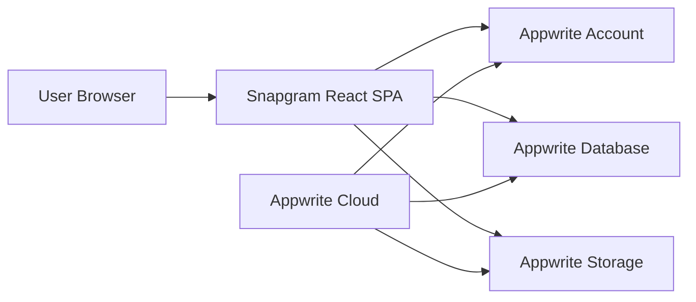

The browser runs the Snapgram SPA. All persistent operations are performed directly against Appwrite SDK clients from the frontend.

## 6. Application Architecture

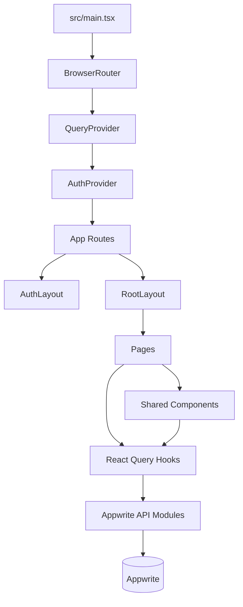

### Major Frontend Areas

| Area | Responsibility |
| --- | --- |
| `src/main.tsx` | Mounts React, router, React Query provider, and auth provider. |
| `src/App.tsx` | Defines public auth routes and protected app routes. |
| `src/context/AuthContext.tsx` | Stores current authenticated user and checks Appwrite session state. |
| `src/_auth` | Sign-in/sign-up layout and forms. |
| `src/_root` | Protected layout and app pages. |
| `src/components/shared` | App-specific reusable UI such as post cards, nav, uploaders, follow buttons. |
| `src/components/ui` | Low-level UI primitives. |
| `src/lib/react-query` | Query and mutation hooks plus cache invalidation helpers. |
| `src/lib/appwrite` | Domain API wrappers around Appwrite SDK. |
| `src/lib/validation` | Zod validation schemas. |
| `src/types` | Form types, Appwrite document types, navigation types. |

## 7. Route Architecture

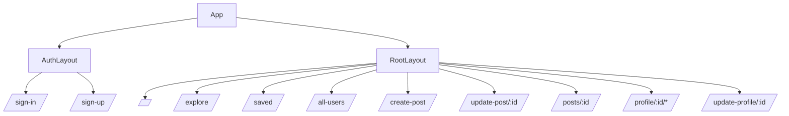

`AuthLayout` is used for unauthenticated pages. If the user is already authenticated, it redirects to `/`.

`RootLayout` protects all main application pages. It waits for auth loading, redirects unauthenticated users to `/sign-in`, and renders the desktop/mobile navigation around the active page.

## 8. Data Model

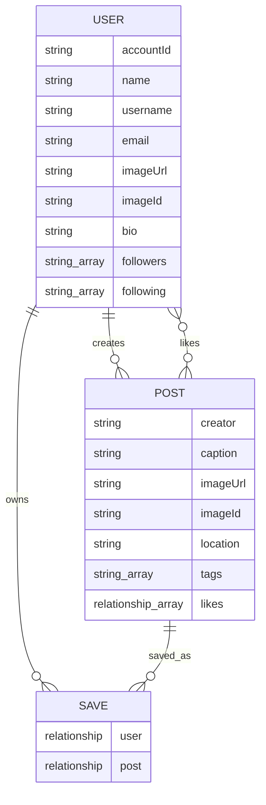

### Collections

| Collection | Purpose |
| --- | --- |
| Users | Stores app profile data linked to Appwrite Auth via `accountId`. |
| Posts | Stores post content and image metadata. |
| Saves | Stores user-to-post saved records. |

### Storage

Appwrite Storage stores post images and profile photos. Documents keep both:

- `imageId`: Appwrite storage file ID.
- `imageUrl`: file view URL used by the UI.

## 9. Authentication Flow

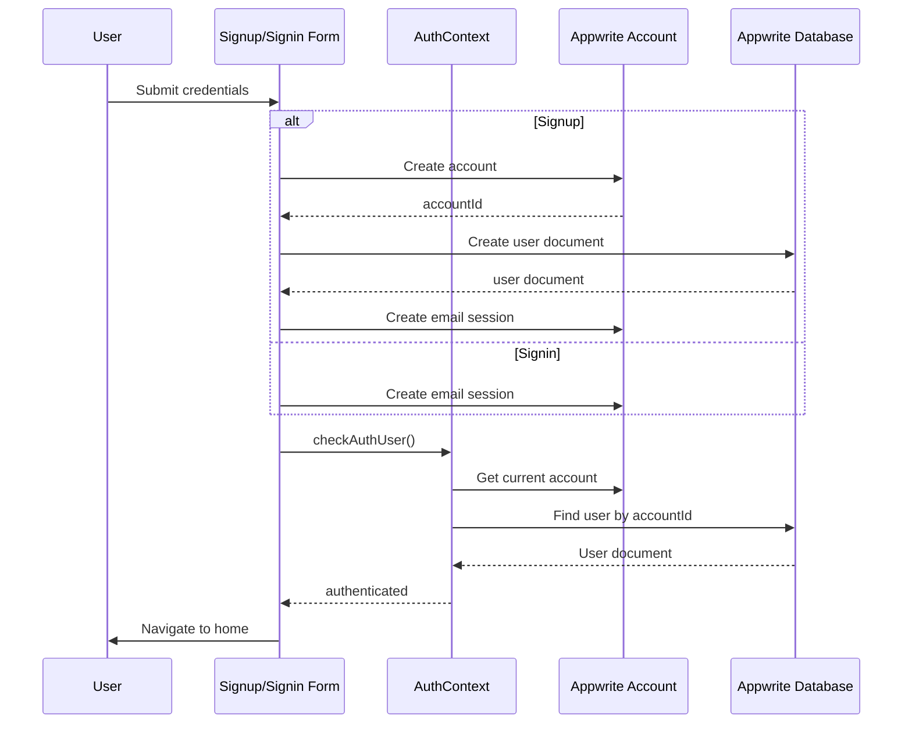

Important design choice: the application uses the Appwrite user document ID as `user.id` in frontend state, not the Appwrite Account ID. Appwrite Account ID is stored as `accountId` inside the user document.

## 10. Core User Flows

### Create Post

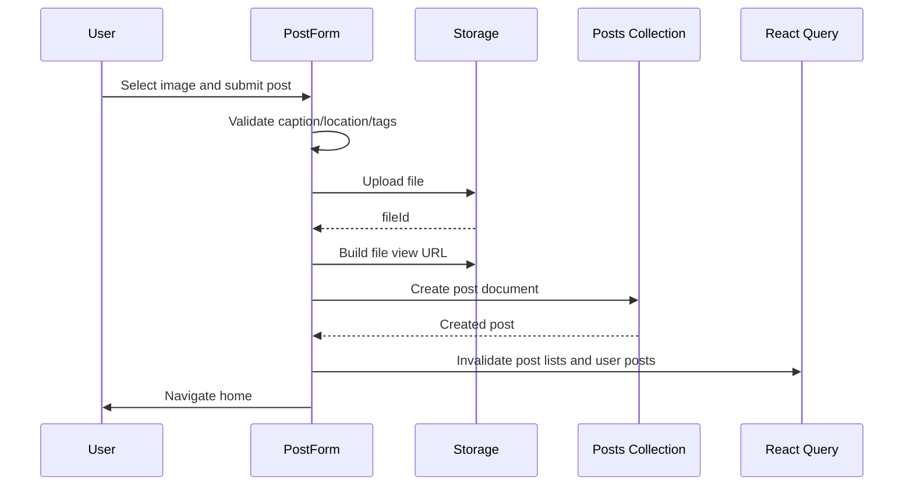

### Like Post

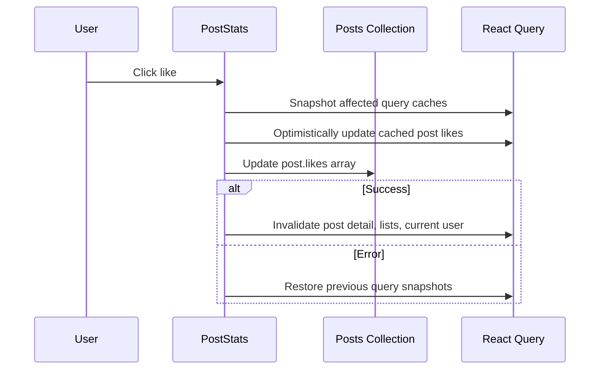

### Save Post

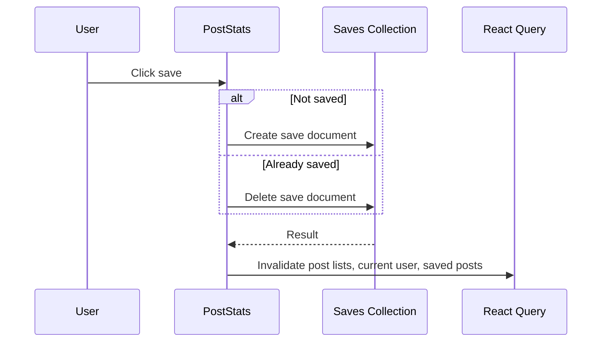

### Follow User

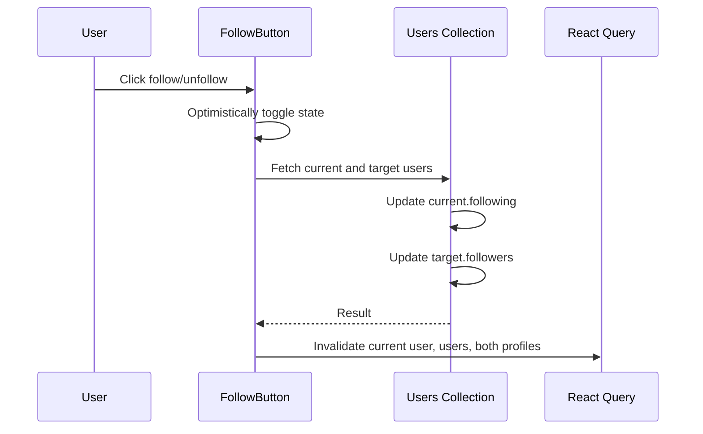

## 11. Flow Charts

### End-To-End User Journey

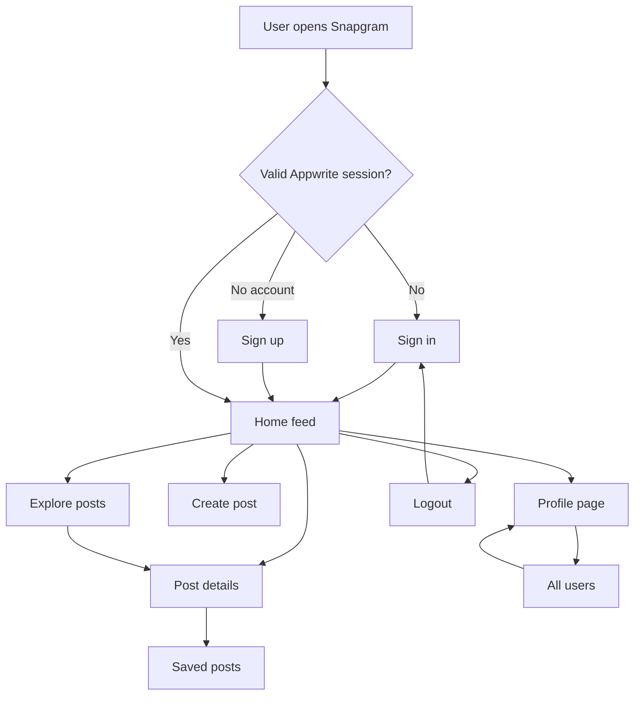

### Protected Routing Flow

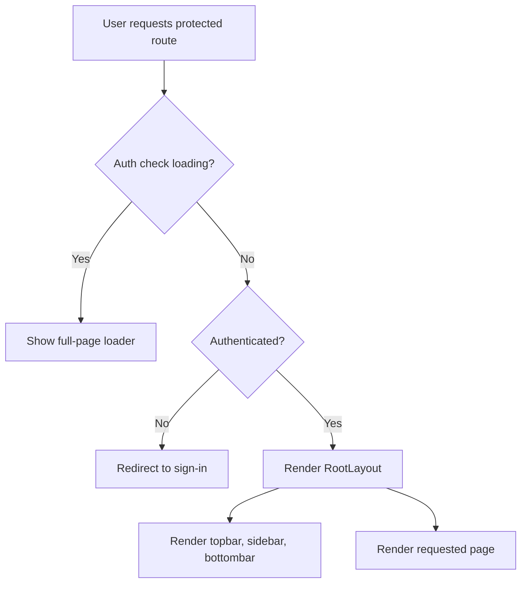

### Post Lifecycle Flow

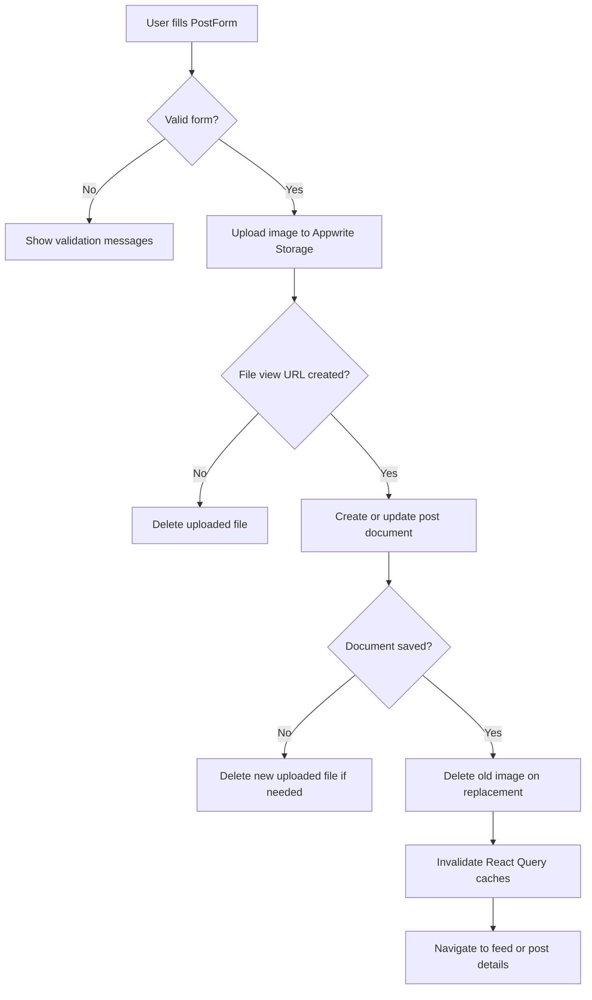

### Browse And Discovery Flow

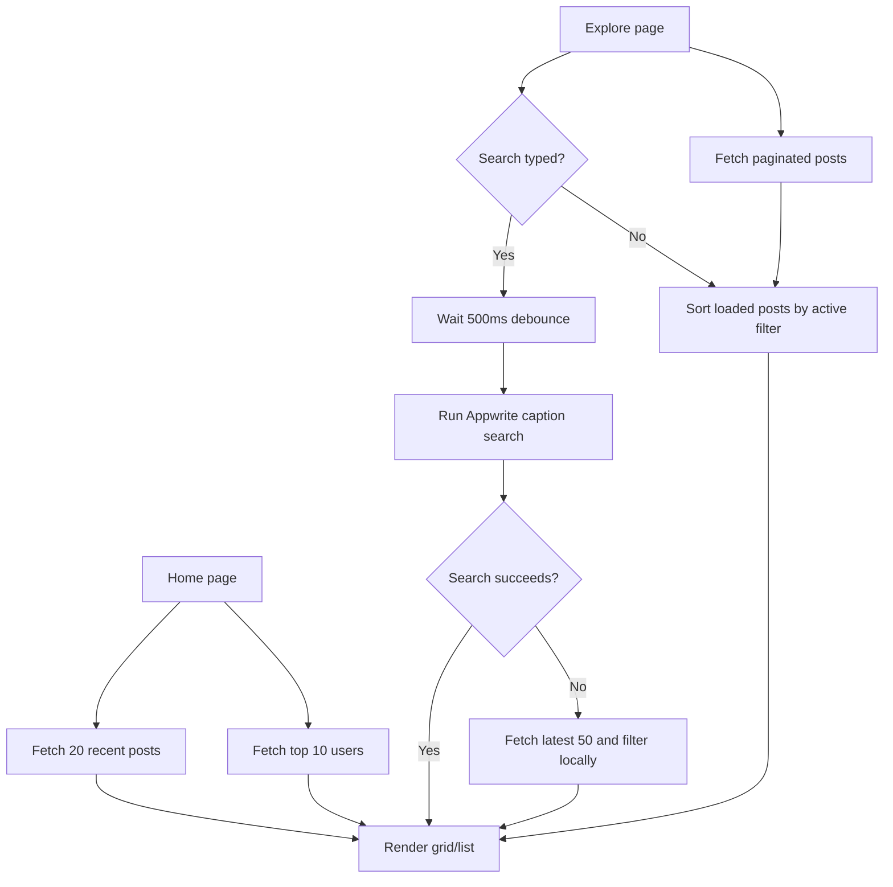

## 12. Page Responsibilities

| Page | Responsibility |
| --- | --- |
| Home | Shows recent posts and a top creator list. |
| Explore | Shows paginated posts, client-side sorting, and debounced search. |
| CreatePost | Hosts `PostForm` in create mode. |
| EditPost | Fetches a post and hosts `PostForm` in update mode. |
| PostDetails | Shows one post, owner-only edit/delete controls, stats, and related posts. |
| Saved | Shows the current user's saved posts. |
| Profile | Shows user details, stats, posts, own liked-posts tab, and follow controls. |
| UpdateProfile | Updates display name, bio, and profile image. |
| AllUsers | Shows all users with follow controls. |

## 13. Caching Strategy

React Query is the app's server-state manager.

Reads are keyed by query keys such as:

- `GET_CURRENT_USER`
- `GET_USERS`
- `GET_RECENT_POSTS`
- `GET_INFINITE_POSTS`
- `GET_POST_BY_ID`
- `GET_USER_POSTS`
- `GET_SAVED_POSTS`
- `SEARCH_POSTS`

Mutations invalidate related queries after success. This keeps feeds, profiles, saved posts, and current user relationships reasonably fresh without manual prop drilling.

## 14. Feed Performance Strategy

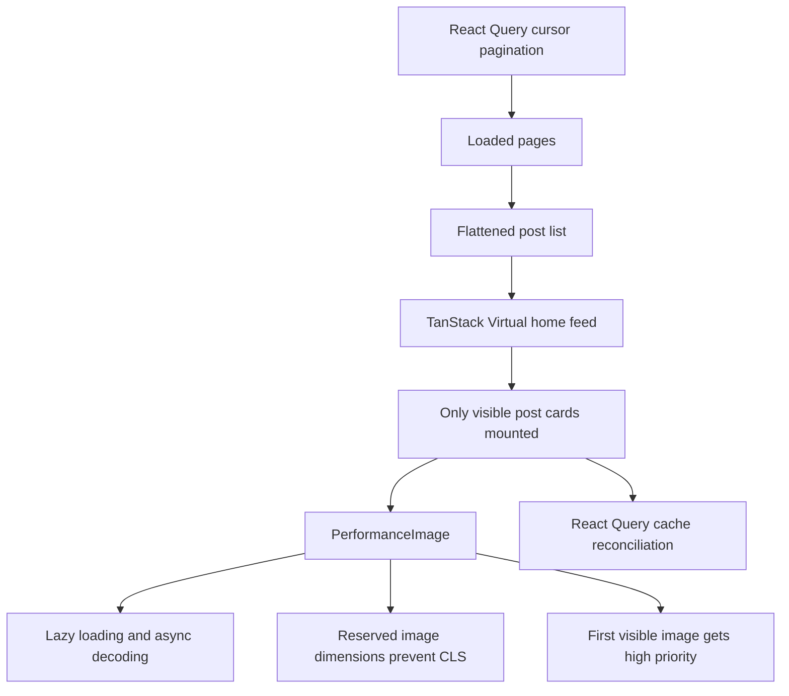

The home feed combines server pagination with DOM virtualization. Image-heavy surfaces use a shared `PerformanceImage` component that reserves layout space, shows a skeleton and blur-up transition while loading, uses native lazy loading for non-priority images, and marks the first visible feed/detail image as high priority.

## 15. Security Model

- Auth is delegated to Appwrite Account sessions.
- Protected routes rely on `AuthContext` and Appwrite session checks.
- Database and storage permissions must be configured in Appwrite.
- Uploaded files are created with public read permission so images can render.
- Owner-only edit/delete controls are hidden in the UI.

Important: UI hiding is not a complete security boundary. Appwrite collection permissions must prevent unauthorized document updates/deletes.

## 16. Deployment View

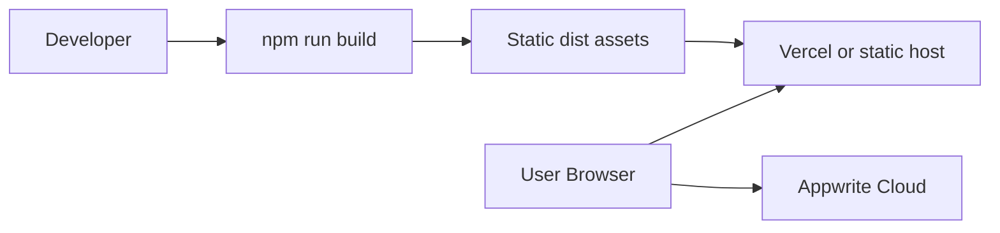

The app builds to static assets through Vite. Runtime backend calls go directly from the browser to Appwrite using environment-injected project and collection IDs.

## 17. High-Level Risks And Tradeoffs

- The frontend talks directly to Appwrite, so permissions must be precise.
- Likes and follows are stored as arrays, which is simple but can suffer race conditions when multiple users update the same document concurrently.
- Saved posts use separate documents, which is cleaner, but `getSavedPosts` fetches each saved post individually.
- Search depends on Appwrite full-text search on `caption`; fallback search only scans the latest 50 posts.
- Auth state depends partly on Appwrite's `cookieFallback` localStorage behavior before calling `getCurrentUser`.
- Public file read permissions make image rendering simple but may not fit private-media requirements.
- Home feed virtualization uses estimated row heights and runtime measurement; large caption/image variations should be checked for scroll smoothness.
