# Snapgram Low-Level Design

## 1. Code Organization

```text
src/
  main.tsx
  App.tsx
  context/
    AuthContext.tsx
  _auth/
    AuthLayout.tsx
    forms/
      SigninForm.tsx
      SignupForm.tsx
  _root/
    RootLayout.tsx
    pages/
      Home.tsx
      Explore.tsx
      CreatePost.tsx
      EditPost.tsx
      PostDetails.tsx
      Saved.tsx
      Profile.tsx
      LikedPosts.tsx
      UpdateProfile.tsx
      AllUsers.tsx
  components/
    forms/
      PostForm.tsx
    shared/
      AppErrorBoundary.tsx
      Bottombar.tsx
      ErrorState.tsx
      FileUploader.tsx
      FollowButton.tsx
      GridPostList.tsx
      InlineSpinner.tsx
      LeftSidebar.tsx
      Loader.tsx
      PerformanceImage.tsx
      PostCard.tsx
      PostStats.tsx
      ProfileUploader.tsx
      Topbar.tsx
      UserCard.tsx
    ui/
      button.tsx
      form.tsx
      input.tsx
      label.tsx
      tabs.tsx
      textarea.tsx
      toast.tsx
      toaster.tsx
      use-toast.ts
  lib/
    appwrite/
      api.ts
      auth.ts
      config.ts
      posts.ts
      relationships.ts
      saves.ts
      storage.ts
      users.ts
      utils.ts
    react-query/
      QueryProvider.tsx
      invalidation.ts
      queries.ts
      queryKeys.ts
    validation/
      index.ts
    utils.ts
  types/
    appwrite.ts
    forms.ts
    index.ts
    navigation.ts
tests/
  components/
  integration/
  msw/
  unit/
  utils/
e2e/
  critical-user-flow.spec.ts
```

## 2. Runtime Bootstrap

`src/main.tsx` renders the application in this order:

1. `BrowserRouter` enables URL-based routing.
2. `QueryProvider` provides one shared React Query client.
3. `AuthProvider` checks and stores auth state.
4. `App` renders the route tree.

`App` wraps routes in `AppErrorBoundary` and mounts `Toaster` once globally.

## 3. Routing Details

| Route | Component | Guard | Notes |
| --- | --- | --- | --- |
| `/sign-in` | `SigninForm` | Public auth shell | Redirects to `/` if authenticated. |
| `/sign-up` | `SignupForm` | Public auth shell | Creates account, profile document, then session. |
| `/` | `Home` | Protected | Recent posts and top creators. |
| `/explore` | `Explore` | Protected | Infinite feed, search, sort filters. |
| `/saved` | `Saved` | Protected | Current user's saved posts. |
| `/all-users` | `AllUsers` | Protected | All creators/users. |
| `/create-post` | `CreatePost` | Protected | Create mode for `PostForm`. |
| `/update-post/:id` | `EditPost` | Protected | Update mode for `PostForm`. |
| `/posts/:id` | `PostDetails` | Protected | Post detail, related posts, owner controls. |
| `/profile/:id/*` | `Profile` | Protected | User profile and nested liked-posts tab. |
| `/update-profile/:id` | `UpdateProfile` | Protected | Current user's profile edit page. |

## 4. AuthContext Design

### State

```ts
type AuthContextState = {
  user: AuthUser;
  isLoading: boolean;
  isAuthenticated: boolean;
  setUser: Dispatch<SetStateAction<AuthUser>>;
  setIsAuthenticated: Dispatch<SetStateAction<boolean>>;
  checkAuthUser: () => Promise<boolean>;
};
```

### Initial User

```ts
{
  id: "",
  name: "",
  username: "",
  email: "",
  imageUrl: "",
  bio: ""
}
```

### Initialization Algorithm

```mermaid
flowchart TD
  Start[AuthProvider mounted]
  CheckCookie[Read localStorage.cookieFallback]
  Empty{Missing or []?}
  LoggedOut[Set logged out and stop loading]
  CheckUser[Run checkAuthUser]
  GetAccount[account.get]
  FindUser[Query users where accountId equals account id]
  Found{User document found?}
  SetAuth[Set user and isAuthenticated true]
  SetUnauth[Reset user and isAuthenticated false]

  Start --> CheckCookie
  CheckCookie --> Empty
  Empty -->|Yes| LoggedOut
  Empty -->|No| CheckUser
  CheckUser --> GetAccount
  GetAccount --> FindUser
  FindUser --> Found
  Found -->|Yes| SetAuth
  Found -->|No| SetUnauth
```

### Critical Auth Detail

The app uses two identifiers:

- Appwrite Account ID: returned by Appwrite Auth and stored as `users.accountId`.
- App User Document ID: stored as `AuthContext.user.id` and used throughout posts, follows, saves, and profile routes.

## 5. Appwrite Configuration

`src/lib/appwrite/config.ts` validates the following environment variables:

```text
VITE_APPWRITE_URL
VITE_APPWRITE_PROJECT_ID
VITE_APPWRITE_DATABASE_ID
VITE_APPWRITE_STORAGE_ID
VITE_APPWRITE_USER_COLLECTION_ID
VITE_APPWRITE_POST_COLLECTION_ID
VITE_APPWRITE_SAVES_COLLECTION_ID
VITE_APPWRITE_LIKES_COLLECTION_ID
VITE_APPWRITE_FOLLOWS_COLLECTION_ID
```

Core Appwrite variables are required and fail fast if missing. The likes/follows collection IDs are optional during migration so existing feeds/profiles can still load; like/follow writes require real collection IDs.

## 6. Domain API Modules

### `auth.ts`

| Function | Input | Output | Behavior |
| --- | --- | --- | --- |
| `createUserAccount` | `NewUser` | `UserDocument` | Creates Appwrite Account, generates initials avatar, saves user document. |
| `saveUserToDB` | user profile payload | `UserDocument` | Creates a user collection document. |
| `signInAccount` | email/password | session | Creates Appwrite email session. Returns current session if one already exists. |
| `getAccount` | none | Appwrite account | Returns current Appwrite Account session user. |
| `getCurrentUser` | none | `UserDocument \| null` | Gets Account, then finds matching user document by `accountId`. |
| `signOutAccount` | none | result | Deletes current session. |

### `posts.ts`

| Function | Behavior |
| --- | --- |
| `createPost` | Uploads image, creates file view URL, creates post document. |
| `searchPosts` | Uses Appwrite caption search; falls back to client-side filtering across recent posts. |
| `getInfinitePosts` | Lists posts ordered by `$updatedAt`, limited to 9, cursor-based. |
| `getPostById` | Fetches one post document and hydrates likes from the likes collection. Throws when ID is missing. |
| `updatePost` | Optionally uploads replacement image, updates post, deletes old image after success. |
| `deletePost` | Deletes post document, then deletes storage image. |
| `getUserPosts` | Fetches posts where `creator` equals user ID and hydrates likes. |
| `getRecentPosts` | Fetches latest 20 posts by `$createdAt` and hydrates likes. |

### `relationships.ts`

| Function | Behavior |
| --- | --- |
| `likePost` | Creates one like relationship document for `(userId, postId)` using a deterministic document ID. |
| `unlikePost` | Deletes one like relationship document by ID. |
| `getLikedPosts` | Lists like documents for a user and fetches the related posts. |
| `getLikeByUserAndPost` | Looks up one like relationship for idempotency/status checks. |
| `hydratePostLikes` | Attaches the post's like documents to a fetched post. |
| `hydratePostsLikes` | Batches like hydration for post lists. |
| `getFollowByUsers` | Looks up the follower-to-following relationship. |
| `followUser` | Creates one follow relationship document for `(followerId, followingId)`. |
| `unfollowUser` | Deletes the follow relationship document if it exists. |
| `hydrateUserFollowCounts` | Adds follower/following counts from the follows collection. |

### `saves.ts`

| Function | Behavior |
| --- | --- |
| `savePost` | Creates a save document with `user` and `post`. |
| `deleteSavedPost` | Deletes a save document by saved record ID. |
| `getSavedPosts` | Fetches save records for user, extracts post IDs, then fetches posts one by one. |

### `users.ts`

| Function | Behavior |
| --- | --- |
| `getUsers` | Lists users by newest first; optional limit. |
| `getUserById` | Fetches one user document. |
| `updateUser` | Optionally uploads replacement profile image, updates name/bio/image, deletes old image after success. |

### `storage.ts`

| Function | Behavior |
| --- | --- |
| `uploadFile` | Uploads a file with public read permission. Throws if missing file. |
| `getFilePreview` | Returns Appwrite file view URL. |
| `deleteFile` | Deletes file by storage file ID. |

## 7. React Query Hooks

### Query Hooks

| Hook | Query Key | API Function |
| --- | --- | --- |
| `useGetPosts` | `GET_INFINITE_POSTS` | `getInfinitePosts` |
| `useSearchPosts` | `SEARCH_POSTS, searchTerm` | `searchPosts` |
| `useGetRecentPosts` | `GET_RECENT_POSTS` | `getRecentPosts` |
| `useGetPostById` | `GET_POST_BY_ID, postId` | `getPostById` |
| `useGetUserPosts` | `GET_USER_POSTS, userId` | `getUserPosts` |
| `useGetSavedPosts` | `GET_SAVED_POSTS, userId` | `getSavedPosts` |
| `useGetLikedPosts` | `GET_LIKED_POSTS, userId` | `getLikedPosts` |
| `useGetCurrentUser` | `GET_CURRENT_USER` | `getCurrentUser` |
| `useGetUsers` | `GET_USERS` | `getUsers` |
| `useGetUserById` | `GET_USER_BY_ID, userId` | `getUserById` |
| `useGetFollowStatus` | `GET_FOLLOW_STATUS, currentUserId, targetUserId` | `getFollowByUsers` |

### Mutation Hooks

| Hook | API Function | Invalidations |
| --- | --- | --- |
| `useCreatePost` | `createPost` | Post lists, user posts |
| `useUpdatePost` | `updatePost` | Post detail, post lists, user posts |
| `useDeletePost` | `deletePost` | Post lists, user posts |
| `useLikePost` | `likePost` | Post detail, post lists, liked posts |
| `useUnlikePost` | `unlikePost` | Post detail, post lists, liked posts |
| `useSavePost` | `savePost` | Post lists, current user, saved posts |
| `useDeleteSavedPost` | `deleteSavedPost` | Post lists, current user, saved posts |
| `useUpdateUser` | `updateUser` | Current user, user detail |
| `useFollowUser` | `followUser` | Current user, users list, both user details, follow status |
| `useUnfollowUser` | `unfollowUser` | Current user, users list, both user details, follow status |

## 8. Form Designs

### Signup Form

Fields:

- `name`
- `username`
- `email`
- `password`

Submit sequence:

1. Validate with `SignupValidation`.
2. Call `useCreateUserAccount`.
3. Call `useSignInAccount`.
4. Call `checkAuthUser`.
5. Reset form.
6. Navigate to `/`.

### Signin Form

Fields:

- `email`
- `password`

Submit sequence:

1. Validate with `SigninValidation`.
2. Call `useSignInAccount`.
3. Call `checkAuthUser`.
4. Reset form.
5. Navigate to `/`.

### Post Form

Used by both create and update flows.

Fields:

- `file`
- `caption`
- `location`
- `tags`

Create submit:

1. Validate with `PostValidation`.
2. Add `userId` from auth context.
3. Call `createPost`.
4. Navigate to `/`.

Update submit:

1. Validate with `PostValidation`.
2. Add `postId`, old `imageId`, and old `imageUrl`.
3. Call `updatePost`.
4. Navigate to `/posts/:id`.

The form also watches `caption`, `location`, and `tags` to render a live preview card.

### Profile Form

Fields:

- `file`
- `name`
- `username` disabled
- `email` disabled
- `bio`

Submit sequence:

1. Validate with `ProfileValidation`.
2. Call `updateUser` with editable fields.
3. Update `AuthContext.user` with new display data.
4. Navigate to `/profile/:id`.

## 9. Component-Level Design

### `PostCard`

Responsibilities:

- Render creator avatar/name.
- Render creation date and location.
- Render caption and tags.
- Render post image.
- Show edit link only for owner.
- Render `PostStats`.

### `PostStats`

Responsibilities:

- Derive liked user IDs from the hydrated like relationship documents on `post.likes`.
- Fetch current user to check saved state.
- Trigger React Query cache-level optimistic like updates.
- Trigger React Query cache-level optimistic unlike updates.
- Trigger React Query cache-level optimistic save updates.
- Rely on mutation rollback snapshots when Appwrite writes fail.

Key behavior:

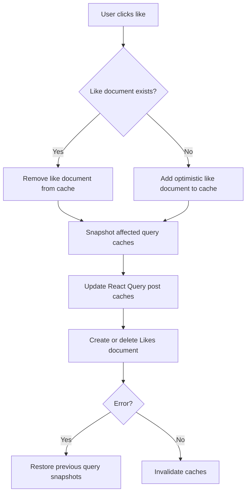

### `FollowButton`

Responsibilities:

- Hide self-follow by rendering a disabled `You` button.
- Query whether a follow document exists for current user and target user.
- Optimistically toggle follow status and follower/following counts.
- Call follow/unfollow mutation.
- Roll back and toast on failure.

### `FileUploader`

Responsibilities:

- Accept image files with `.png`, `.jpeg`, and `.jpg`.
- Pass selected files to React Hook Form.
- Render local preview using `URL.createObjectURL`.

### `ProfileUploader`

Same basic dropzone behavior as `FileUploader`, but styled for round profile images.

### `PerformanceImage`

Responsibilities:

- Render optimized post images across feed, grids, saved posts, and details.
- Use `loading="lazy"` for non-priority images.
- Use `decoding="async"`.
- Use `fetchPriority="high"` for first visible/detail images.
- Provide a `sizes` hint for responsive layout contexts.
- Reserve image dimensions through existing image classes to reduce CLS.
- Show a skeleton and blurred background while the image is loading.
- Fade from blurred placeholder to the decoded image on load.

### Navigation Components

| Component | Usage |
| --- | --- |
| `LeftSidebar` | Desktop navigation, profile summary, logout. |
| `Topbar` | Mobile top navigation and logout. |
| `Bottombar` | Mobile bottom navigation. |

## 10. Page-Level Design

### Home

Data:

- `useGetRecentPosts()`
- `useGetUsers(10)`
- `useVirtualizer()` over the loaded post list

UI:

- Virtualized feed list of `PostCard`.
- Creator rail of `UserCard`.
- Separate error states for posts and creators.

Performance behavior:

- `home-container` is the virtualizer scroll element.
- `estimateSize` reserves each post row before measurement.
- `measureElement` updates row size after rendering.
- `overscan` keeps a small buffer of cards mounted above and below the viewport.
- The first visible post image is loaded eagerly with high fetch priority.

### Explore

Data:

- `useGetPosts()` for infinite post pagination.
- `useSearchPosts(debouncedSearch)` for search.

Local state:

- `searchValue`
- `activeFilter`: `all`, `liked`, or `latest`

Behavior:

- Debounces search input by 500ms.
- Loads more posts when bottom sentinel enters viewport.
- Deduplicates posts by `$id` across pages.
- Sorts loaded posts by likes or creation date.

### PostDetails

Data:

- `useGetPostById(id)`
- `useGetUserPosts(post.creator.$id)`

Behavior:

- Shows edit/delete only to the creator.
- Delete calls post deletion mutation and navigates back.
- Related posts are posts by the same creator excluding the current post.

### Saved

Data:

- `useGetSavedPosts(user.id)`

Behavior:

- Shows empty state when no saved posts exist.
- Computes unique saved creators from fetched saved posts.
- Links each saved item to its post detail page.

### Profile

Data:

- `useGetUserById(id)`
- `useGetUserPosts(id)`

Behavior:

- Shows profile identity and counts.
- Shows edit profile for owner.
- Shows follow button for other users.
- Shows liked-posts tab only for owner.

### AllUsers

Data:

- `useGetUsers()`

Behavior:

- Shows all users as `UserCard` entries.
- Each card includes follow/unfollow control.

## 11. Validation Rules

| Schema | Rules |
| --- | --- |
| `SignupValidation` | name min 2, username min 2, email valid, password min 8 |
| `SigninValidation` | email valid, password min 8 |
| `ProfileValidation` | file custom, name min 2, username min 2, email valid, bio string |
| `PostValidation` | caption 5-2200, file custom, location required max 1000, tags string |

Critical detail: `file` uses `z.custom<File[]>()`, so "file required" is enforced by `uploadFile`, not by the schema.

## 12. Error Handling

| Location | Strategy |
| --- | --- |
| Render tree | `AppErrorBoundary` catches render errors and resets on route change. |
| Forms | `try/catch` around async submit, errors shown by toast. |
| Queries | Page-level `ErrorState` with retry callbacks. |
| Mutations | Toast messages and React Query invalidation. |
| Optimistic UI | Likes/saves roll back React Query cache snapshots; follows roll back local button state on failure. |
| Storage cleanup | New uploads are deleted if URL/document update fails; old files are deleted after successful replacement. |

## 13. Testing Layer

| Test Area | Tooling | Coverage |
| --- | --- | --- |
| Unit | Vitest | Zod schemas, utility helpers, debounce hook. |
| Component | Vitest, React Testing Library | Auth guards, `PostCard`, `PostStats`, `FollowButton`, `FileUploader`, `PerformanceImage`. |
| Integration | Vitest, React Testing Library | Optimistic like/save cache rollback and create-post submission/cache invalidation. |
| Network mocks | MSW | Browser request interception for integration tests. |
| E2E | Playwright | Credential-backed login, create post, like, save, logout journey. |

### Test Commands

```bash
npm run test
npm run test:e2e
npm run test:all
```

`npm run test:e2e` starts the Vite dev server through Playwright. The E2E scenario is skipped unless `E2E_USER_EMAIL` and `E2E_USER_PASSWORD` are available, because it exercises the real Appwrite-backed application.

## 14. Feed Performance

### Home Feed Virtualization

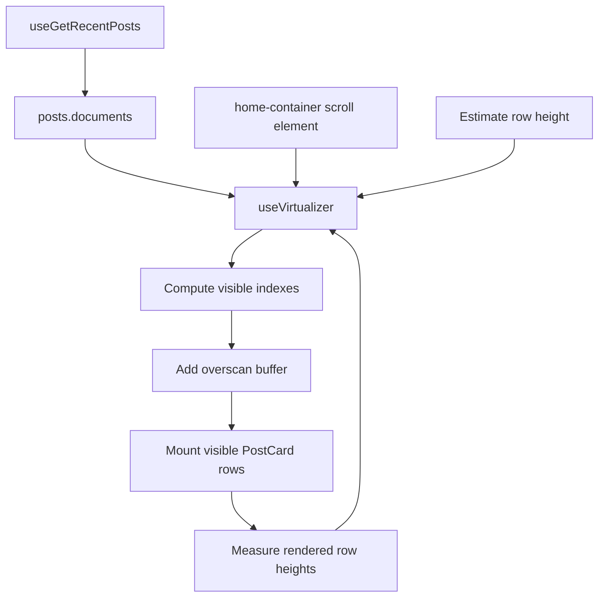

Only the visible home feed rows and a small overscan buffer are mounted. The full loaded post array still exists in memory, but the DOM does not grow linearly with scroll depth.

### Image Loading

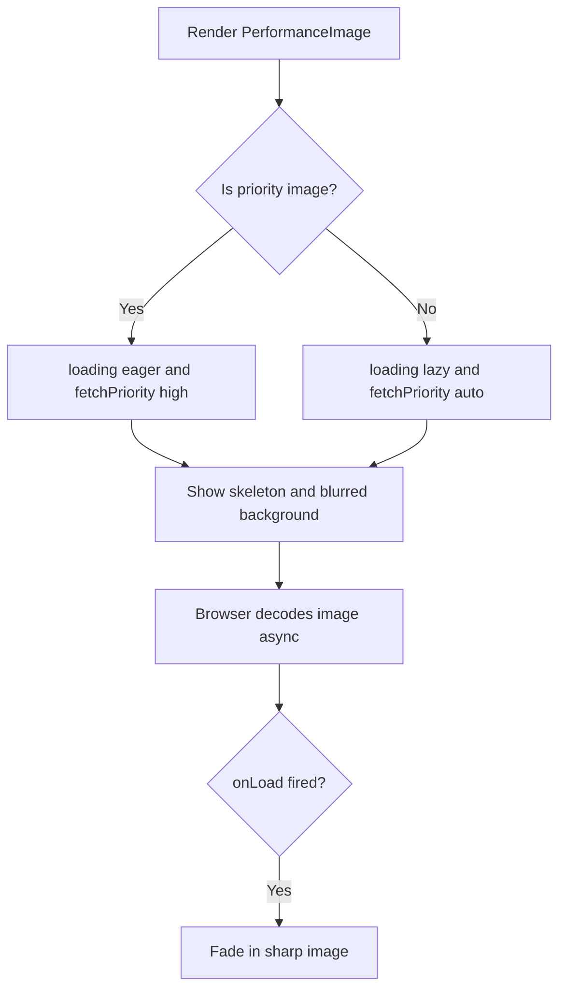

The component relies on stable CSS dimensions from the caller, such as `post-card_img`, `grid-post_link`, `saved-card_img`, and `post_details-img`, to reserve layout space before the image finishes loading.

## 15. Important Algorithms

### Tag Parsing

Input:

```text
Art, Travel, Weekend
```

Algorithm:

```ts
tags?.replace(/ /g, "").split(",").filter(Boolean) || []
```

Output:

```text
["Art", "Travel", "Weekend"]
```

### Infinite Pagination

1. Fetch posts ordered by `$updatedAt`.
2. Limit each page to 9 documents.
3. Use the last document ID as the next `cursorAfter`.
4. Stop when a page returns no documents.

### Search Fallback

1. Try Appwrite `Query.search("caption", searchTerm)`.
2. If it fails, fetch latest 50 posts.
3. Build searchable text from caption, location, creator name, creator username, and tags.
4. Return posts whose normalized text contains the normalized search term.

## 16. Detailed Flow Charts

### Signup Flow

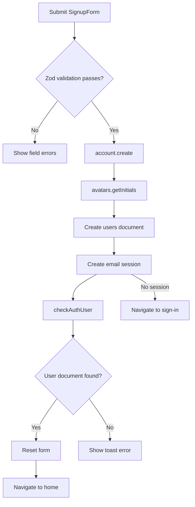

### Signin Flow

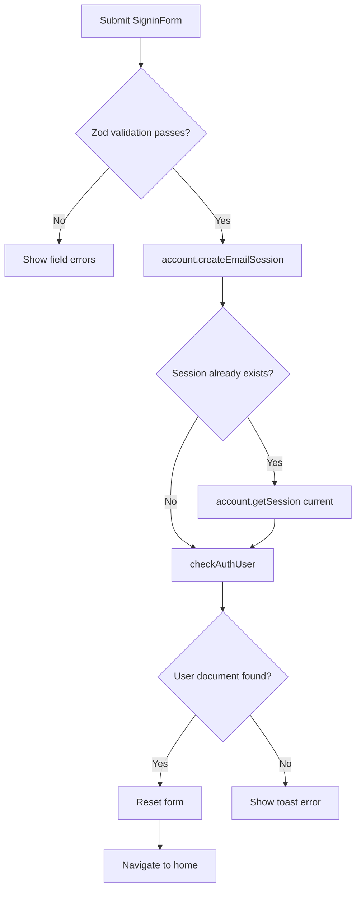

### Create Post Flow

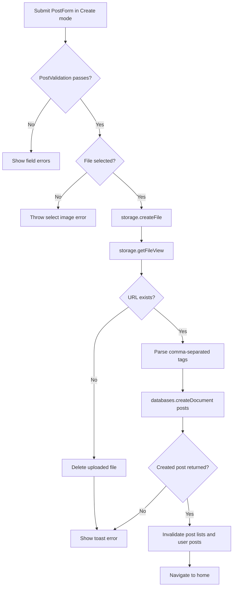

### Update Post Flow

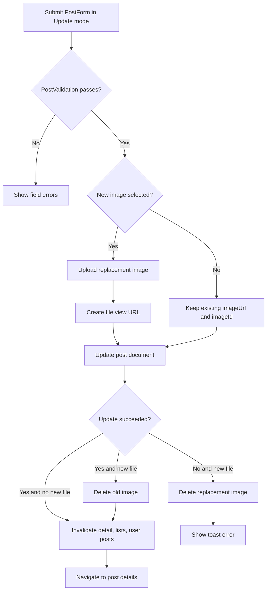

### Delete Post Flow

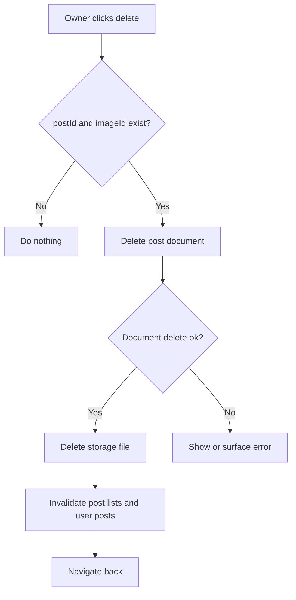

### Save And Unsave Flow

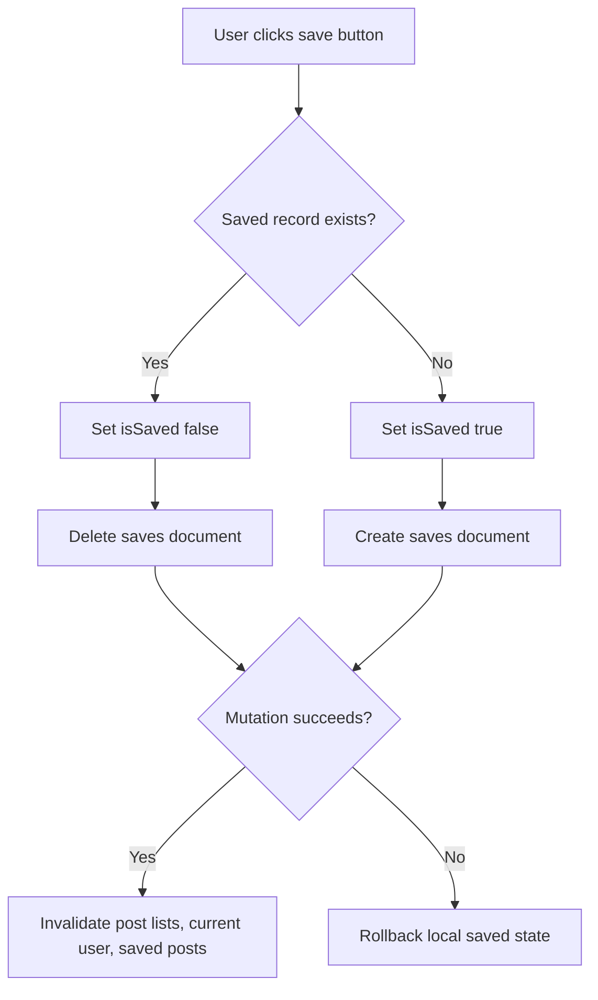

### Follow And Unfollow Flow

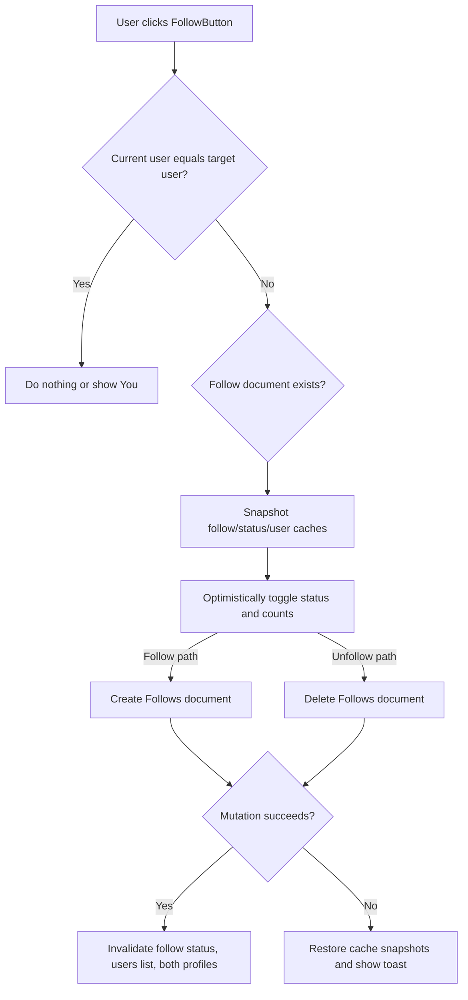

### Explore Search And Pagination Flow

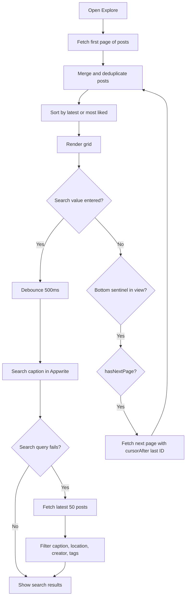

### Update Profile Flow

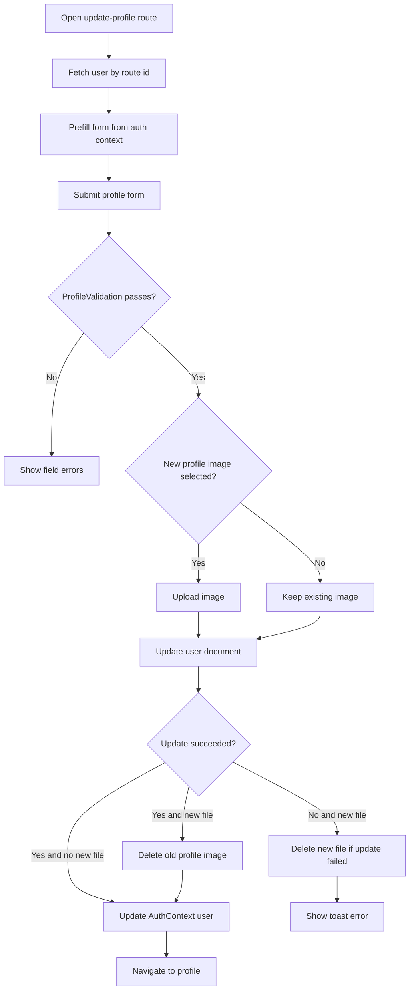

## 17. Permissions And Security Requirements

Appwrite must allow authenticated users to read and write the required collections. Storage uploads are created with public read permission so images are visible in the browser.

Recommended production hardening:

- Only creators should update/delete their own posts.
- Users should only update their own user document.
- Users should only create/delete their own save records.
- Users should only create/delete their own like and follow relationship records.
- Each `(userId, postId)` like and `(followerId, followingId)` follow should remain unique through deterministic IDs or backend constraints.

## 18. Edge Cases

| Case | Current Behavior |
| --- | --- |
| Missing Appwrite env var | App throws immediately. |
| No Appwrite session | Protected routes redirect to `/sign-in`. |
| Existing session during sign-in | Returns current session instead of failing. |
| Create post without image | `uploadFile` throws `Please select an image before posting.` |
| Search index unavailable | Falls back to latest-50 client-side search. |
| Like/save mutation fails | Previous React Query cache snapshots are restored. |
| Post image is below viewport | Browser lazily loads and decodes it asynchronously. |
| Long feed grows | Home feed keeps only virtualized visible rows mounted. |
| Update image succeeds but document update fails | Newly uploaded file is deleted. |
| User replaces profile/post image | Old file is deleted after successful update. |
| User views own profile | Edit and liked-posts tab are visible. |
| User views another profile | Follow/unfollow button is visible. |

## 19. Known Limitations

- No comments or messaging.
- No real-time subscriptions.
- No server-side authorization logic in this repo.
- Likes and follows can race because arrays are overwritten.
- Saved posts are fetched with an N+1 pattern.
- Search is primarily caption-based unless fallback executes.
- Profile username and email are displayed during edit but are not editable.
- UI owner checks must be backed by Appwrite permissions to be secure.
- Responsive `sizes` hints are present, but Appwrite file view URLs do not currently generate multiple image widths.

## 20. Suggested Future Improvements

- Move likes/follows to separate collections for better concurrency.
- Add Appwrite Functions for sensitive writes.
- Add real-time updates with Appwrite Realtime.
- Add comments collection and comment UI.
- Add post deletion confirmation.
- Add stronger file validation for size and count.
- Add tests for auth redirects, post creation, optimistic updates, and profile update.
- Improve saved posts API to avoid fetching each post separately.
- Add true responsive image variants through Appwrite previews or a dedicated image CDN.
